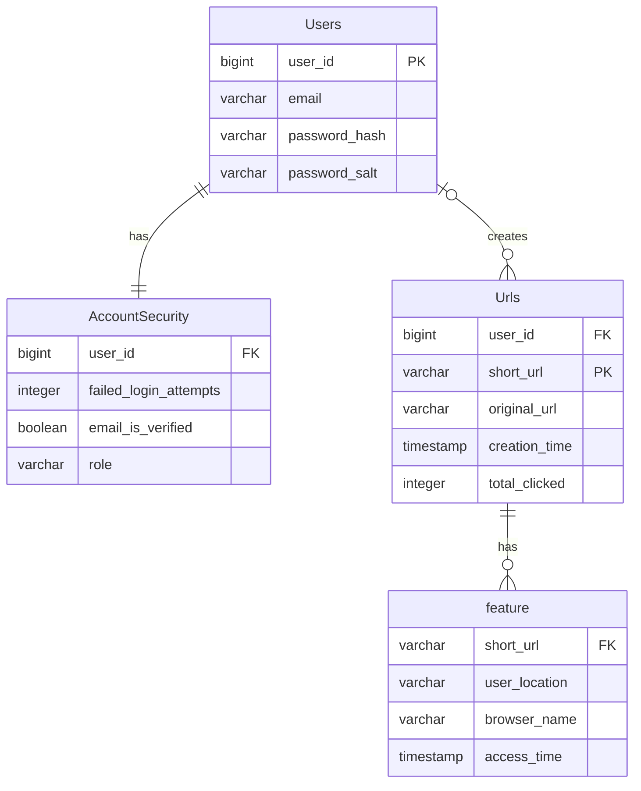

# URL Shortener API built with Fastify

## Install Dependencies

Use [**npm**](https://docs.npmjs.com/downloading-and-installing-node-js-and-npm#using-a-package-manager-to-install-nodejs-and-npm) as the package manager. Run the following command to install the dependencies:

```
npm install
```

## Database Setup

Run the SQL commands in [migration.sql](./src/database/migration.sql) file to create the database tables.

To seed sample data, run the files in [seeds](./src/database/seeds) directory like this:

```
npx ts-node src/database/seeds/<file>.ts
```

## Available Scripts

In the project directory, you can run:

```
npm dev
```

To start the app in dev mode.

```
npm start
```

For production mode

```
npm test
```

Run the test cases.


# Database

This database is designed to store information about users and short URLs created by users of a URL shortening service.

## Entity Relationship Diagram (ERD)


The ERD shows the relationships between four main entities in the database: Users, AccountSecurity, Feature, and Urls. 

### Users
The `Users` entity stores information about users, including their user ID, email, password hash, and password salt.

### AccountSecurity
The `AccountSecurity` entity has a one-to-one relationship with the `Users` entity, and stores security-related information for each user, such as their failed login attempts, email verification status, and role.

### Feature
The `Feature` entity has a one-to-many relationship with the `Urls` entity, and stores information about each time a short URL is accessed, including the user's location, browser name, and access time.

### Urls
The `Urls` entity stores information about each short URL in the system, including the user ID of the user who created the URL, the short URL itself, the original URL that the short URL points to, the creation time of the URL, and the total number of clicks on the URL.

## Design Decisions

When designing the database, I chose to use a relational database model to represent the data, as this allows for easy querying and data retrieval. I also decided to use separate entities for user information, security information, and short URL analytics, in order to keep the database organized and to reduce data duplication.

